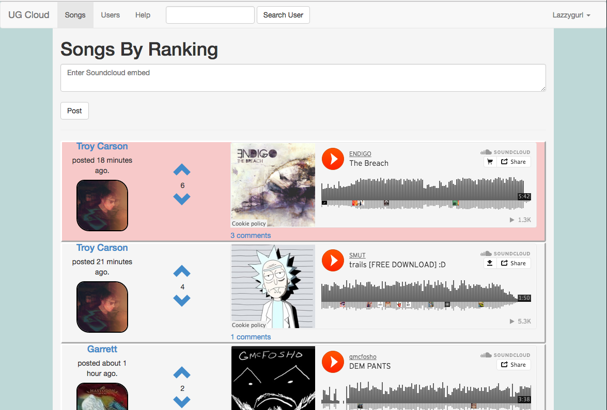
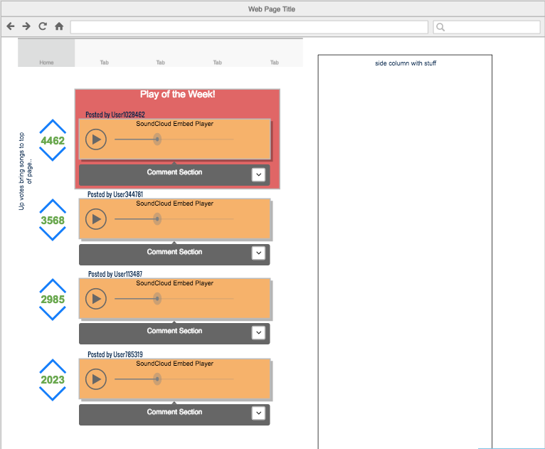

#UG Cloud
--
###Full Stack Rails App

UG Cloud (UnderGround SoundCloud) is a full stack Web application designed as a platform for filtering through under-ground music on SoundCloud. Users can post there favorite music from SoundCloud that has under 100K plays after making a profile. From there, users will use UG's voting system that will rank and order all songs based on "Song Score". The highest rated songs will move to the top of the charts (and page).

##How to Use

UG Cloud is easy to use! Simply make a profile, and after sign in, you'll be able to post your favorite embed links from SoundCloud directly into the songs page. Use the help tab for further instructions if needed.

##To View

Visit https://safe-depths-71969.herokuapp.com/posts to view and sign up, or simply visit https://github.com/troycarson100/Project2_redo to view the repository.

##Development process

Technologies used: HTML / CSS / JavaScript / Ruby / Ruby On Rails / BootStrap 

Using Rails MVC framework helped me connect back end to front end with ease. BootStap helped me maintain a responsive view with most of my site. UG Cloud is compatible for all sizes!

##Original Wireframe

##Not-Yet-Implemented
 * Use SoundCloud API to prevent uploads of songs with over 100K plays.
 * Implement AJAX to have songs contiously play while changing views.
 * Create a daily, weekly, and monthly page to delete all songs are restart based on their respective times.
 
##User Stories
 
 As a user, I enjoy UG Cloud's vote based ranking system. 
 
 As a user, I enjoy the layout and how easy it is to navigate. I can hop on and quickly discover good music that isnt mainstream.
 
 As a user, I like that the "All Users" page shows me each users highest voted song and has a search feature to go with it.
 